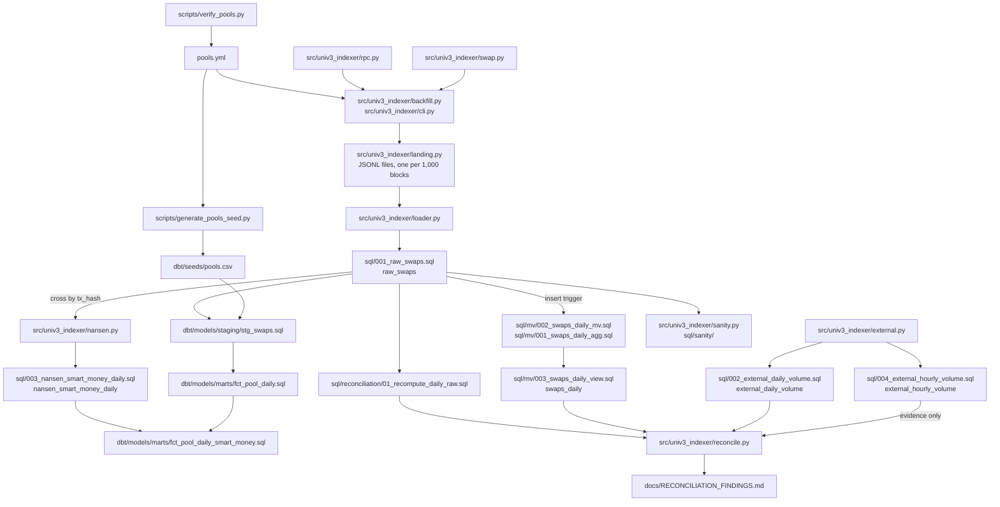

# univ3-clickhouse-indexer

Uniswap v3 `Swap` events, read from an Ethereum JSON-RPC node, landed as raw JSONL,
loaded into ClickHouse, modelled with dbt, and reconciled twice: internally against a
materialized view, to the unit, and externally against an independent source of daily
volume. A third source, the Nansen API, adds what a Swap log cannot carry: who signed the
transaction.

Short on time? [docs/WALKTHROUGH.md](docs/WALKTHROUGH.md) is a ten-minute tour.

It is a learning project: I built it to work with ClickHouse hands-on (MergeTree parts and
merges, sparse primary indexes, materialized views, the system tables) rather than read
about it. The design choices are written down in [DECISIONS.md](DECISIONS.md), with the
number that was measured wherever one was, and what went wrong along the way is kept where
it happened instead of being cleaned up (for example the double count in
[docs/MATERIALIZED_VIEW.md](docs/MATERIALIZED_VIEW.md) and the measurements spoiled by a
cache in [docs/SCHEMA_EXPERIMENTS.md](docs/SCHEMA_EXPERIMENTS.md)).

Data in the working database on 2026-09-21: 1,110,676 swaps of 4 pools over 43 days
(2026-08-09 to 2026-09-20). Some documents were measured on earlier states of the same
table (863,587, 881,187 and 898,404 rows) and say so.

## Architecture



The JSONL landing zone sits between the node and the database on purpose: the backfill
costs about 22,000 provider calls, and with the raw logs on disk ClickHouse can be dropped
and reloaded as often as the schema changes without making another call. Each file is
named after its block range, which makes a repeated delivery rewrite the same file.

## How to run it

### The demo: Docker only, no API key

```
make demo
```

Runs the whole pipeline on the 242 real Swap logs committed as test fixtures, inside a
throw-away ClickHouse: land, create the materialized view, load and verify, reload twice,
`dbt build` (seed, models and every dbt test), internal reconciliation. About a minute once the images are
pulled. It removes its containers, network and volumes when it ends, and returns a
non-zero exit code if any step does not hold.

### The full path

Requirements: Docker with the compose plugin, [uv](https://docs.astral.sh/uv/), `make`.
uv downloads Python 3.12 by itself.

| Step | Command | Needs an API key? |
|---|---|---|
| Secrets files, outside the repo (names in `.env.example`) | by hand | |
| Start ClickHouse | `make up` | no |
| Check pool addresses on chain | `scripts/verify_pools.py` | **Alchemy** |
| Backfill Swap logs to the landing zone | `PYTHONPATH=src uv run python -m univ3_indexer.cli --days 30` | **Alchemy** |
| Load the landing zone, idempotent, self-verifying | `make load` | no |
| Create and backfill the materialized view, once | `make mv-setup` | no |
| Sanity queries, report in `reports/sanity.md` | `make sanity` | no |
| dbt: seed, staging, marts, tests | `make dbt-build` | no |
| Show that every dbt test can fail (breaks data in throw-away databases) | `make dbt-prove` | no |
| Daily volume from the external source | `make fetch-external` | no (public API) |
| Hourly candles, to see in which hours a day differs (optional) | `make fetch-external-hourly` | no (public API) |
| Reconcile, reports in `reports/` | `make reconcile` | no |
| Smart-money trades, 1 credit per page, cached outside the repo (optional) | `PYTHONPATH=src uv run python -m univ3_indexer.nansen --fetch-tgm USDC --from … --to …` | **Nansen** |
| Cross them with `raw_swaps`, store the aggregate (optional) | `PYTHONPATH=src uv run python -m univ3_indexer.nansen --daily USDC --from … --to …` | no |
| Tests and lint | `make test`, `make lint` | no |

`make reconcile` compares only days that are complete on our side and closed on the
source's, and flags a pool-day beyond 1% **and** 1,000 USD; both thresholds and the day rule
are parameters (`RECONCILE_THRESHOLD`, `RECONCILE_ABS_THRESHOLD`, `RECONCILE_DAYS=all`). Its
exit code reflects the internal check only. `make load` reads the landing zone from the same
data directory the backfill writes to; when the two run as different users, pass
`LANDING=/path/to/landing`. Without a Nansen key nothing breaks: the aggregate table is
created empty and its mart builds with no rows.

`make test` needs neither the network nor a key. Tests that need ClickHouse skip with an
explicit reason when the server is not reachable.

ClickHouse listens on `127.0.0.1` only (8123 HTTP, 9000 native). `make ch-client` opens a
SQL shell; `make down` stops the server and keeps the data in a named volume.

### Backfill

```
PYTHONPATH=src uv run python -m univ3_indexer.cli --days 30 --dry-run    # the plan, nothing fetched
tmux new-session -d -s backfill \
  'PYTHONPATH=src .venv/bin/python -m univ3_indexer.cli --days 30 --rps 5 \
     --log-file /var/lib/univ3-indexer/backfill.log'
tail -f /var/lib/univ3-indexer/backfill.log
```

The provider's free tier accepts `eth_getLogs` over at most 10 blocks: 21,600 calls for 30
days, about 72 minutes at 5 calls per second. Data and checkpoint live outside the repo
(`/var/lib/univ3-indexer` as root, `~/.local/share/univ3-indexer` otherwise, or
`UNIV3_DATA_DIR`). Stop it with Ctrl-C; run the same command to resume: the block window
is fixed in `plan.json` on the first run, and the checkpoint only ever points at files that
are completely on disk. Exit codes: `0` done, `2` arguments, `3` the provider rejected the
request (not retried), `4` network, `5` too many retries (aborted to protect the quota),
`130` interrupted.

## Design decisions

One or two sentences each; the reasoning is in [DECISIONS.md](DECISIONS.md), in my words.

| Decision | In short | Measured |
|---|---|---|
| Local Docker, not ClickHouse Cloud [#1](DECISIONS.md#1-local-docker-instead-of-the-clickhouse-cloud-trial) | To watch the real MergeTree engine; one command to reproduce. | |
| RPC as the source, another source only to check [#2](DECISIONS.md#2-rpc-as-the-raw-source-the-subgraph-only-as-an-external-check) | Reconciling against what you ingested from proves nothing. | 10-block limit on `eth_getLogs`: 11 blocks is an HTTP 400, [docs/MEASUREMENTS.md](docs/MEASUREMENTS.md) |
| Plain JSON-RPC, no web3.py [#3](DECISIONS.md#3-plain-json-rpc-over-requests-not-web3py) | Two methods; chunking, retries and signed int256 decoding under my control. | Decoding checked against protocol invariants on real logs |
| Two secrets files [#4](DECISIONS.md#4-two-secrets-files-split-by-who-is-allowed-to-read-them) | Unattended processes get database access without being able to read the API keys. | |
| Pinned ClickHouse 26.3 LTS, Python 3.12 [#5](DECISIONS.md#5-pinned-versions-clickhouse-263-lts-and-python-312) | Same behaviour next month. | |
| Hard 3 GiB memory limit, no swap [#6](DECISIONS.md#6-a-hard-3-gib-memory-limit-with-no-swap-and-what-clickhouse-does-with-it) | A database that swaps gets slow in a way that is hard to attribute. | ClickHouse derives 2.70 GiB from the cgroup |
| `dbt-adapters==1.24.5` [#7](DECISIONS.md#7-dbt-adapters-must-be-pinned-to-1245-when-dbt-is-added) | The only version dbt-core 1.12 and dbt-clickhouse 1.10.3 both accept. | |
| Pool addresses verified on chain [#8](DECISIONS.md#8-pool-addresses-come-from-orwee-and-are-trusted-only-after-on-chain-checks), fourth pool derived from the factory [#9](DECISIONS.md#9-a-fourth-pool-derived-from-the-factory-instead-of-typed) | An address is trusted after `factory()` and `getPool()` agree, never typed from memory. | 4 of 4 pools valid |
| MergeTree; deduplication belongs to the load [#10](DECISIONS.md#10-engine-mergetree-with-deduplication-left-to-the-load) | Finalised logs never change, so duplicates can only come from the pipeline. | Without `FINAL` an unmerged Replacing table read a total 10% high; with the real key `FINAL` kept pruning intact and cost 2.6x on the full aggregate while unmerged, 1.3x merged (an earlier, stronger claim was measured with another key and is corrected in #10). The view counts a redelivered row twice whatever the engine. [docs/SCHEMA_EXPERIMENTS.md](docs/SCHEMA_EXPERIMENTS.md) |
| `ORDER BY (pool_address, block_timestamp, block_number, log_index)` [#11](DECISIONS.md#11-order-by-pool_address-block_timestamp-block_number-log_index-primary-key-on-the-first-two) | Chosen for filtered queries; the whole-table aggregate is a full scan with any key. | One pool, one day: 32,768 rows read against 634,211 with a key that lacks the time |
| Monthly partitions [#12](DECISIONS.md#12-partition-by-month-for-management-and-not-for-speed) | A management unit, not a speed feature. | No read changed with or without it |
| Int256 / UInt256 / UInt128, hashes in binary [#13](DECISIONS.md#13-types-lossless-integers-and-hashes-and-addresses-in-binary) | Lossless, and the largest column halved. | A real 1,136 WETH swap needs 70 bits; binary hashes made the table 30% smaller (84.8 bytes per row) |
| Only whole, closed days are compared [#15](DECISIONS.md#15-the-external-comparison-only-looks-at-days-that-are-whole-on-both-sides) | A difference that disappears by waiting a day says nothing about either source. | A candle compared while open read -2.14%; closed, -0.55% |
| Flagged means beyond 1% and beyond 1,000 USD [#16](DECISIONS.md#16-a-pool-day-is-flagged-beyond-1-and-beyond-1000-usd) | In a thin pool a percentage alone does not discriminate. | One 617 USD swap is 44% of a day; 12 of 24 pool-days beyond 1% add up to 2,098 USD |
| GeckoTerminal, not the subgraph, as the external check [#17](DECISIONS.md#17-the-external-check-is-geckoterminal-not-the-subgraph) | A source anyone can query without a key; it publishes no methodology. | |
| Nothing denormalised into the raw table [#14](DECISIONS.md#14-nothing-from-poolsyml-is-denormalised-into-the-raw-table) | `pools.yml` stays the single source; the daily mart denormalises on purpose, as the counter-example. | |

Two more things that were measured and are worth reading:
[docs/MATERIALIZED_VIEW.md](docs/MATERIALIZED_VIEW.md) (a view created over 863,587
existing rows had an empty target; 17,600 later rows reached it through the trigger alone)
and [docs/QUERY_PERFORMANCE.md](docs/QUERY_PERFORMANCE.md) (the same 50,000 rows in one
insert took 0.14 s and in a thousand inserts 74.6 s, with 491 merges rewriting the data 92
times).

## How this was built

The design decisions are mine. In [DECISIONS.md](DECISIONS.md), entries 1 to 9 are in my
words; entries 10 to 17 were drafted by a coding agent from my notes and carry a banner that
says so until I rewrite them, and the same goes for the findings and the limitations below.
The implementation was done in unattended coding-agent sessions working from written
specifications. Every change arrived as a pull request that I merged myself; the agents work
on branches and do not push to `main` ([AGENTS.md](AGENTS.md) ends with a table of which of
its rules a barrier enforces and which depend on the agent following them). Where I had to
redirect an agent there is a line under [Agent corrections](DECISIONS.md#agent-corrections).

## Reconciliation findings

**DRAFT — to be reviewed and rewritten by Roberto**

Run of 2026-09-20: 898,404 swaps, 4 pools, 128 pool-days on both sides, 120 compared, 12
flagged beyond 1% and 1,000 USD. The full draft, each figure with the section of the evidence
behind it, is [docs/RECONCILIATION_FINDINGS.md](docs/RECONCILIATION_FINDINGS.md); the snapshot of that run is in
[docs/evidence/2026-09-20/](docs/evidence/2026-09-20/reconciliation.md). Ten earlier days
were added on 2026-09-21 to test finding 7 on days it had not been fitted on (1,110,676 swaps,
163 pool-days compared, 17 flagged): [docs/evidence/2026-09-21/](docs/evidence/2026-09-21/README.md).

| # | Finding | State |
|---|---|---|
| [1](docs/RECONCILIATION_FINDINGS.md#1-the-pipeline-agrees-with-itself-exactly--explained) | `raw_swaps` and the materialized view agree exactly: 0 differences on 128 pool-days | EXPLAINED |
| [2](docs/RECONCILIATION_FINDINGS.md#2-partial-days-and-open-candles--explained) | Partial days (-22% to -35% on 2026-08-20) and a candle compared while still open (-2.14%, then -0.55%). Only whole, closed days are compared; the 8 excluded are listed | EXPLAINED |
| [3](docs/RECONCILIATION_FINDINGS.md#3-the-day-boundary-is-not-the-cause--explained-a-negative-result) | The day boundary is not the cause: the distance is smallest at a shift of 0 h in all four pools; one hour either way gives 1.8% to 13% in three of them | EXPLAINED |
| [4](docs/RECONCILIATION_FINDINGS.md#4-which-leg-is-valued-does-not-matter-in-the-liquid-pools--explained) | Which leg is valued changes the liquid pools by -0.004% and +0.02%. It does not test whether USDC was worth 1 USD | EXPLAINED |
| [5](docs/RECONCILIATION_FINDINGS.md#5-in-the-liquid-pools-the-30-day-totals-agree-and-the-daily-noise-is-centred--explained) | Liquid pools: 30-day totals at +0.10% and +0.24%; daily noise 15 up / 15 down in one, 19 / 11 in the other | EXPLAINED |
| [6](docs/RECONCILIATION_FINDINGS.md#6-2026-08-27-two-pools-of-the-same-pair-off-in-opposite-directions--partly-explained) | 2026-08-27: the two USDC/WETH pools at -1.65% and +1.35%, the pair at +0.16%. Not a misattribution: the two differences sit in different hours, and one of them is unexplained | PARTLY EXPLAINED |
| [7](docs/RECONCILIATION_FINDINGS.md#7-round-trips-inside-one-block-valued-differently--partly-explained) | The large differences coincide with same-block round trips consistent with a sandwich pattern. "The source filters them" is refuted (fixes 0 of 24 days, breaks 64 of 96). "The source values them at a going price" fixes 15 of 24 and breaks 6 of 96 in sample. Out of sample, with the protocol committed first: fixes 6 of 10 and a placebo fixes 0 of 24, but the correlation falls from +0.72 to +0.05 and the largest difference of the project is untouched by it | PARTLY EXPLAINED |
| [8](docs/RECONCILIATION_FINDINGS.md#8-2026-08-29-three-pools-high-on-a-quiet-saturday--partly-explained) | 2026-08-29: three pools high on a quiet Saturday. Not one effect: one pool is covered by finding 7, one is 18 USD, one stays at +1.44% | PARTLY EXPLAINED |
| [9](docs/RECONCILIATION_FINDINGS.md#9-days-on-which-the-source-reports-more-than-the-chain--partly-explained) | Days on which the source reports more than the chain (-2.04%, -1.27%): +0.02% and -0.02% under the valuation reading, 85% of each in one hour. The source publishes no methodology | PARTLY EXPLAINED |
| [10](docs/RECONCILIATION_FINDINGS.md#10-in-thin-pools-a-percentage-alone-does-not-discriminate--explained) | In thin pools a percentage does not discriminate: one 617 USD swap is 44% of a day. Flagging needs 1% and 1,000 USD | EXPLAINED |

Still open: eight pool-days (four found in sample, four in the hold-out), most of them
located to one to three hours, listed at the end of the draft.

## Limitations

**DRAFT — to be reviewed and rewritten by Roberto**

- **One protocol, one chain.** Uniswap v3 on Ethereum mainnet, four pools.
- **No reorg handling, by staying out of their reach.** A backfill ends at the block the
  node reports as finalised (`eth_getBlockByNumber("finalized")`); if the provider does not
  know that tag it falls back to 64 blocks behind the tip and says in the log and in
  `plan.json` that the window is not finalised. It never revisits a block. The data loaded
  before 2026-09-21 was fetched with the 64-block rule; on that day
  `scripts/verify_landing_is_canonical.py` compared the block hash kept in the landing zone
  with the chain for 680 blocks (the end of every file and the last 100 blocks of every
  window) and all of them matched. `raw_swaps` has no `block_hash` and no
  `tx_index`; the landing zone keeps the whole raw log, so both can be recovered without
  calling the provider again.
- **No `tx.from`.** A Swap log carries `sender` and `recipient`, which are mostly routers. The
  signer is known only for the fraction of transactions that came back from Nansen
  ([docs/NANSEN.md](docs/NANSEN.md)).
- **A stablecoin is taken at exactly 1 USD**, and a pool without one gets `volume_usd = NULL`.
  Nothing in the pipeline checks the first assumption, although the external source's
  `close_usd` for USDC/WETH 0.01% is a USDC price and is stored (0.9990 to 1.0008 over the
  window): it is never read.
- **One external source, with no published methodology.** Finding 7 is a reading that fits the
  numbers, not a fact about GeckoTerminal.
- **Batch backfill.** No continuous ingestion, no orchestration, no alerting: `make` targets
  run by hand.
- **"`onchain` is read-only for agents" is a rule without a barrier**: there is one ClickHouse
  user and it can drop anything.
- **Weekend scale.** About 900,000 rows. What [DECISIONS.md](DECISIONS.md) and
  [docs/QUERY_PERFORMANCE.md](docs/QUERY_PERFORMANCE.md) conclude about `ORDER BY`,
  partitions, projections and indexes was measured at that size.
- **Nansen on the free tier.** Labels for the main counterparties exist only as a design.

## Where things are

| Path | What |
|---|---|
| [docs/WALKTHROUGH.md](docs/WALKTHROUGH.md) | Ten minutes: what to open, in what order, and the question each piece answers |
| [DECISIONS.md](DECISIONS.md) | Why things are the way they are, and what each choice cost |
| [pools.yml](pools.yml) | The only source of pool addresses, each verified on chain |
| [sql/](sql/001_raw_swaps.sql) | Plain SQL: tables, the materialized view, sanity, reconciliation, examples |
| [dbt/](dbt/dbt_project.yml) | Seed, `stg_swaps`, `dim_pools`, `fct_pool_daily`, `fct_pool_daily_smart_money`, tests |
| [docs/RECONCILIATION_FINDINGS.md](docs/RECONCILIATION_FINDINGS.md) | The ten findings of the reconciliation, each with its state (draft) |
| [docs/evidence/2026-09-20/](docs/evidence/2026-09-20/reconciliation_evidence.md) | Snapshot of one run: report, evidence (12 sections of numbers) and the per-day CSV |
| [docs/H2_PREREGISTRATION.md](docs/H2_PREREGISTRATION.md) | What was going to be tested out of sample, committed before the data was fetched |
| [docs/evidence/2026-09-21/](docs/evidence/2026-09-21/README.md) | Snapshot of the run with ten more days: the out-of-sample test and placebo, and the reconciliation over 43 days |
| [docs/MEASUREMENTS.md](docs/MEASUREMENTS.md) | The provider's limits and the size of the data, measured |
| [docs/SCHEMA_EXPERIMENTS.md](docs/SCHEMA_EXPERIMENTS.md) | Candidate schemas on the real data (Spanish) |
| [docs/MATERIALIZED_VIEW.md](docs/MATERIALIZED_VIEW.md) | A materialized view is an insert trigger: procedure and observations |
| [docs/EXTERNAL_SOURCE.md](docs/EXTERNAL_SOURCE.md) | The external source: documented, observed, unknown |
| [docs/NANSEN.md](docs/NANSEN.md) | What Nansen adds to a Swap log (the signer and its classification), what runs on the free tier with the credits spent, and the production design that was not run |
| [docs/QUERY_PERFORMANCE.md](docs/QUERY_PERFORMANCE.md) | Projection, bloom filter, one insert against a thousand |

## License

[MIT](LICENSE).
