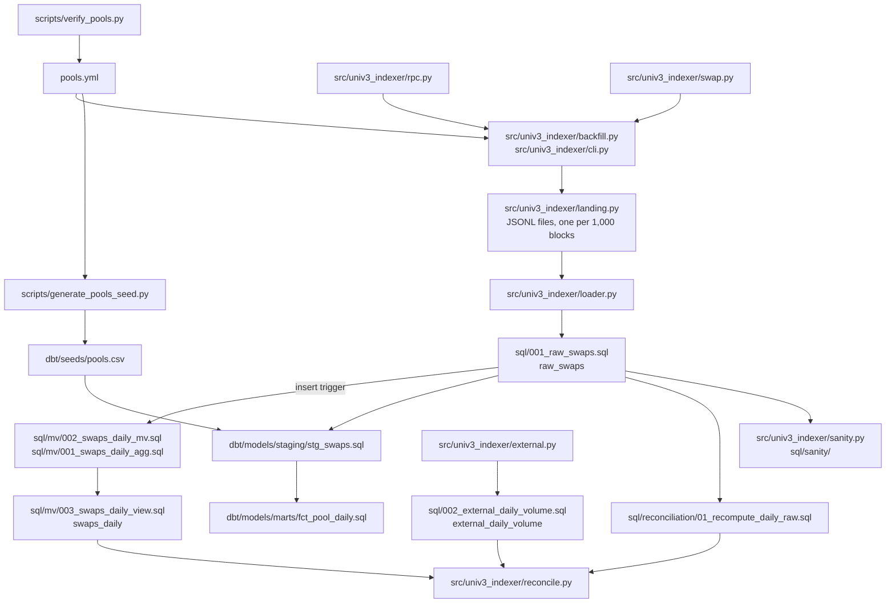

# univ3-clickhouse-indexer

Uniswap v3 `Swap` events, read from an Ethereum JSON-RPC node, landed as raw JSONL,
loaded into ClickHouse, modelled with dbt, and reconciled twice: internally against a
materialized view, to the unit, and externally against an independent source of daily
volume.

It is a learning project: I built it to work with ClickHouse hands-on (MergeTree parts and
merges, sparse primary indexes, materialized views, the system tables) rather than read
about it. Every design choice is written down in [DECISIONS.md](DECISIONS.md) with the
number that was measured for it, and the places where something went wrong are kept, not
cleaned up.

Data in the working database today: 881,187 swaps of 4 pools over 31 days
(2026-08-20 to 2026-09-19).

## Architecture



The JSONL landing zone sits between the node and the database on purpose: the backfill
costs about 22,000 provider calls, and with the raw logs on disk ClickHouse can be dropped
and reloaded as often as the schema changes without making another call. Each file is
named after its block range, which makes a repeated delivery rewrite the same file.

## How to run it

### The demo: Docker only, no API key

```
make demo
```

Runs the whole pipeline on the 242 real Swap logs committed as test fixtures, inside a
throw-away ClickHouse: land, create the materialized view, load and verify, reload twice,
`dbt build` (50 tests), internal reconciliation. About a minute once the images are
pulled. It removes its containers, network and volumes when it ends, and returns a
non-zero exit code if any step does not hold.

### The full path

Requirements: Docker with the compose plugin, [uv](https://docs.astral.sh/uv/), `make`.
uv downloads Python 3.12 by itself.

| Step | Command | Needs an API key? |
|---|---|---|
| Secrets files, outside the repo (names in `.env.example`) | by hand | |
| Start ClickHouse | `make up` | no |
| Check pool addresses on chain | `scripts/verify_pools.py` | **Alchemy** |
| Backfill Swap logs to the landing zone | `python -m univ3_indexer.cli --days 30` | **Alchemy** |
| Load the landing zone, idempotent, self-verifying | `make load` | no |
| Create and backfill the materialized view, once | `make mv-setup` | no |
| Sanity queries, report in `reports/sanity.md` | `make sanity` | no |
| dbt: seed, staging, marts, tests | `make dbt-build` | no |
| Daily volume from the external source | `make fetch-external` | no (public API) |
| Reconcile, reports in `reports/` | `make reconcile` | no |
| Tests and lint | `make test`, `make lint` | no |

`make test` needs neither the network nor a key. Tests that need ClickHouse skip with an
explicit reason when the server is not reachable.

ClickHouse listens on `127.0.0.1` only (8123 HTTP, 9000 native). `make ch-client` opens a
SQL shell; `make down` stops the server and keeps the data in a named volume.

### Backfill

```
PYTHONPATH=src uv run python -m univ3_indexer.cli --days 30 --dry-run    # the plan, nothing fetched
tmux new-session -d -s backfill \
  'PYTHONPATH=src .venv/bin/python -m univ3_indexer.cli --days 30 --rps 5 \
     --log-file /var/lib/univ3-indexer/backfill.log'
tail -f /var/lib/univ3-indexer/backfill.log
```

The provider's free tier accepts `eth_getLogs` over at most 10 blocks: 21,600 calls for 30
days, about 72 minutes at 5 calls per second. Data and checkpoint live outside the repo
(`/var/lib/univ3-indexer` as root, `~/.local/share/univ3-indexer` otherwise, or
`UNIV3_DATA_DIR`). Stop it with Ctrl-C; run the same command to resume: the block window
is fixed in `plan.json` on the first run, and the checkpoint only ever points at files that
are completely on disk. Exit codes: `0` done, `2` arguments, `3` the provider rejected the
request (not retried), `4` network, `5` too many retries (aborted to protect the quota),
`130` interrupted.

## Design decisions

One or two sentences each; the reasoning is in [DECISIONS.md](DECISIONS.md), in my words.

| Decision | In short | Measured |
|---|---|---|
| Local Docker, not ClickHouse Cloud [#1](DECISIONS.md#1-local-docker-instead-of-the-clickhouse-cloud-trial) | To watch the real MergeTree engine; one command to reproduce. | |
| RPC as the source, another source only to check [#2](DECISIONS.md#2-rpc-as-the-raw-source-the-subgraph-only-as-an-external-check) | Reconciling against what you ingested from proves nothing. | 10-block limit on `eth_getLogs`: 11 blocks is an HTTP 400, [docs/MEASUREMENTS.md](docs/MEASUREMENTS.md) |
| Plain JSON-RPC, no web3.py [#3](DECISIONS.md#3-plain-json-rpc-over-requests-not-web3py) | Two methods; chunking, retries and signed int256 decoding under my control. | Decoding checked against protocol invariants on real logs |
| Two secrets files [#4](DECISIONS.md#4-two-secrets-files-split-by-who-is-allowed-to-read-them) | Unattended processes get database access without being able to read the API keys. | |
| Pinned ClickHouse 26.3 LTS, Python 3.12 [#5](DECISIONS.md#5-pinned-versions-clickhouse-263-lts-and-python-312) | Same behaviour next month. | |
| Hard 3 GiB memory limit, no swap [#6](DECISIONS.md#6-a-hard-3-gib-memory-limit-with-no-swap-and-what-clickhouse-does-with-it) | A database that swaps gets slow in a way that is hard to attribute. | ClickHouse derives 2.70 GiB from the cgroup |
| `dbt-adapters==1.24.5` [#7](DECISIONS.md#7-dbt-adapters-must-be-pinned-to-1245-when-dbt-is-added) | The only version dbt-core 1.12 and dbt-clickhouse 1.10.3 both accept. | |
| Pool addresses verified on chain [#8](DECISIONS.md#8-pool-addresses-come-from-orwee-and-are-trusted-only-after-on-chain-checks), fourth pool derived from the factory [#9](DECISIONS.md#9-a-fourth-pool-derived-from-the-factory-instead-of-typed) | An address is trusted after `factory()` and `getPool()` agree, never typed from memory. | 4 of 4 pools valid |
| MergeTree; deduplication belongs to the load [#10](DECISIONS.md#10-engine-mergetree-with-deduplication-left-to-the-load) | Finalised logs never change, so duplicates can only come from the pipeline. | Replacing with a non-unique key lost 64.4% of rows; without `FINAL` a total read 10.5% high; `FINAL` on unmerged parts 2.8x slower, no pruning. [docs/SCHEMA_EXPERIMENTS.md](docs/SCHEMA_EXPERIMENTS.md) |
| `ORDER BY (pool_address, block_timestamp, block_number, log_index)` [#11](DECISIONS.md#11-order-by-pool_address-block_timestamp-block_number-log_index-primary-key-on-the-first-two) | Chosen for filtered queries; the whole-table aggregate is a full scan with any key. | One pool, one day: 32,768 rows read against 634,211 with a key that lacks the time |
| Monthly partitions [#12](DECISIONS.md#12-partition-by-month-for-management-and-not-for-speed) | A management unit, not a speed feature. | No read changed with or without it |
| Int256 / UInt256 / UInt128, hashes in binary [#13](DECISIONS.md#13-types-lossless-integers-and-hashes-and-addresses-in-binary) | Lossless, and the largest column halved. | A real 1,136 WETH swap needs 70 bits; binary hashes made the table 30% smaller (84.8 bytes per row) |
| Nothing denormalised into the raw table [#14](DECISIONS.md#14-nothing-from-poolsyml-is-denormalised-into-the-raw-table) | `pools.yml` stays the single source; the daily mart denormalises on purpose, as the counter-example. | |

Two more things that were measured and are worth reading:
[docs/MATERIALIZED_VIEW.md](docs/MATERIALIZED_VIEW.md) (a view created over 863,587
existing rows had an empty target; 17,600 later rows reached it through the trigger alone)
and [docs/QUERY_PERFORMANCE.md](docs/QUERY_PERFORMANCE.md) (the same 50,000 rows in one
insert took 0.14 s and in a thousand inserts 74.6 s, with 491 merges rewriting the data 92
times).

## How this was built

The design decisions are mine, and so is [DECISIONS.md](DECISIONS.md); entries that an
agent drafted from my notes say so at the top until I rewrite them. The implementation was
done in unattended coding-agent sessions working from written specifications. Every change
arrived as a pull request that a person reviewed and merged; the agents have no access to
`main`. Where an agent got something wrong, or I had to redirect it, there is a line under
[Agent corrections](DECISIONS.md#agent-corrections).

## Reconciliation findings

PENDING — written by Roberto

## Limitations

PENDING — written by Roberto

<!--
Candidates for this section, for Roberto to choose from and word. Not part of the README.
- No reorg handling: the backfill stays 64 blocks behind the tip and never revisits a block.
- raw_swaps has no block_hash and no tx_index (the landing zone does).
- A stablecoin is taken at exactly 1 USD; pools without a stablecoin get volume_usd = NULL.
- "onchain is read-only" is a rule without a barrier: the only ClickHouse user can drop anything.
- One protocol (Uniswap v3) and one chain (Ethereum mainnet).
- No tx.from: a Swap log carries sender and recipient, which are mostly routers.
-->

## Where things are

| Path | What |
|---|---|
| [DECISIONS.md](DECISIONS.md) | Why things are the way they are, and what each choice cost |
| [pools.yml](pools.yml) | The only source of pool addresses, each verified on chain |
| [sql/](sql/001_raw_swaps.sql) | Plain SQL: tables, the materialized view, sanity, reconciliation, examples |
| [dbt/](dbt/dbt_project.yml) | Seed, `stg_swaps`, `dim_pools`, `fct_pool_daily`, tests |
| [docs/MEASUREMENTS.md](docs/MEASUREMENTS.md) | The provider's limits and the size of the data, measured |
| [docs/SCHEMA_EXPERIMENTS.md](docs/SCHEMA_EXPERIMENTS.md) | Candidate schemas on the real data (Spanish) |
| [docs/MATERIALIZED_VIEW.md](docs/MATERIALIZED_VIEW.md) | A materialized view is an insert trigger: procedure and observations |
| [docs/EXTERNAL_SOURCE.md](docs/EXTERNAL_SOURCE.md) | The external source: documented, observed, unknown |
| [docs/NANSEN.md](docs/NANSEN.md) | What Nansen adds to a Swap log (the signer and its classification), what runs on the free tier with the credits spent, and the production design that was not run |
| [docs/QUERY_PERFORMANCE.md](docs/QUERY_PERFORMANCE.md) | Projection, bloom filter, one insert against a thousand |
| [docs/SQL_PRACTICE.md](docs/SQL_PRACTICE.md) | 17 ClickHouse SQL exercises on this data (Spanish), solutions apart |
